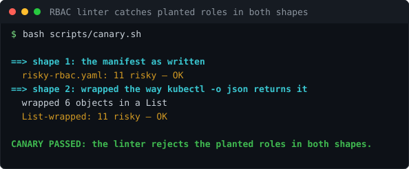

# Lab 08: Conjur Secrets on Kubernetes plus KubiScan RBAC Audit

<p align="center"></p>


[](https://github.com/ChromeData/Conjur-Kubernetes-KubiScan/actions/workflows/tests.yml)

**Pods get their secrets from Conjur so none holds a static credential. Then a second check hunts the RBAC permissions that make perfect secrets management pointless. Both halves, because doing one without the other is theatre.**

| | |
|---|---|
| **Domains** | CyberArk/Idira, Linux, Kubernetes |
| **Built on** | [cyberark/conjur](https://github.com/cyberark/conjur) + [helm chart](https://github.com/cyberark/conjur-oss-helm-chart), [cyberark/KubiScan](https://github.com/cyberark/KubiScan) |
| **Cost** | $0 (local kind/minikube). **Runtime** ~4 hours |
| **Status** | Run against a real kind cluster. The linter silently missed every planted role on live kubectl output; fixed, 15 findings now (output in findings/). KubiScan cross-check still pending |

## Situation

You can do secrets perfectly, with Conjur brokering every credential and nothing static in a pod, and still be wide open. A service account that can escalate, bind, or create pods can mint itself a token that reads everything. Secrets injection and RBAC are two halves of one problem.

## Task

Do both halves: the clean secrets path, and the audit that checks whether the cluster's permissions quietly undo it.

## Action

KubiScan (CyberArk's tool) runs against the live cluster and finds risky subjects, roles, and pods from the real permissions. I also wrote an offline pre check ([scripts/rbac_lint.py](./scripts/rbac_lint.py)) that reads the RBAC YAML and flags the same escalation tricks before anything is applied, so they are caught at PR time.

To have something to catch, [k8s/risky-rbac.yaml](./k8s/risky-rbac.yaml) plants six escalation tricks, each of which beats good secrets hygiene:

| Risk | Why it beats secrets injection |
|---|---|
| escalate | grant yourself any permission |
| bind | bind full admin to yourself |
| secrets read | just read all the secrets directly |
| pods create | schedule a pod wearing a privileged token |
| wildcard everything | full admin by another name |
| SA to wildcard binding | makes the wildcard live |

## Result

The linter catches all six. 11 offline tests prove it, including that the clean workload trips none and that harmless rules (list configmaps, get pods) are not false flagged. CI also schema checks every manifest with kubeconform. The two checks agreeing is the cross check: static analysis on the YAML, plus the live scan.

## What I did not build

Conjur and KubiScan are CyberArk's. The workload, the planted RBAC fixture, the offline linter, and the tests are mine.

## Run it

```bash
make cluster
make conjur
make deploy
make apply-rbac
make kubiscan
python scripts/rbac_lint.py k8s/*.yaml   # offline cross check
make destroy
```

Needs kind or minikube, kubectl, Helm, Python 3.

## Findings

[`findings/`](./findings/) holds the live-cluster run: the linter silently missing every planted role on `kubectl` output, then catching all 15 after the fix. [LAB-NOTES.md](./LAB-NOTES.md) is the log.

## License

Lab code: MIT ([LICENSE](./LICENSE)). Conjur and KubiScan keep their licenses, credited above.
